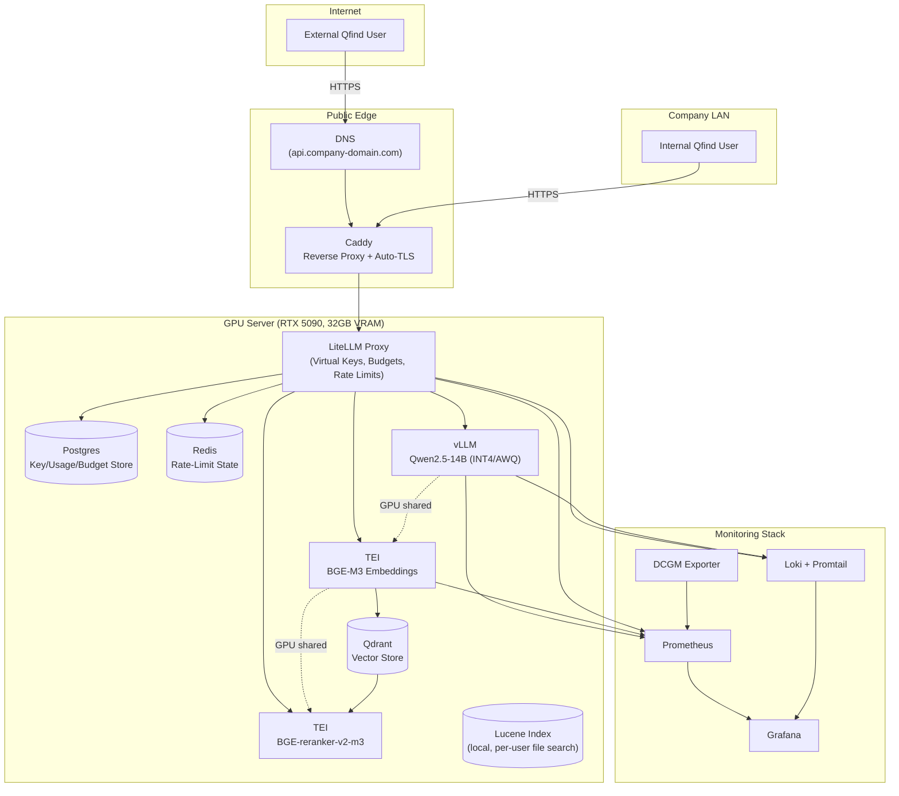
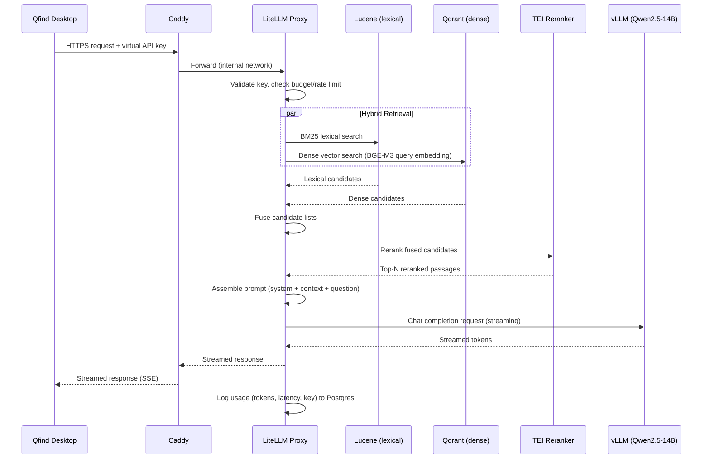
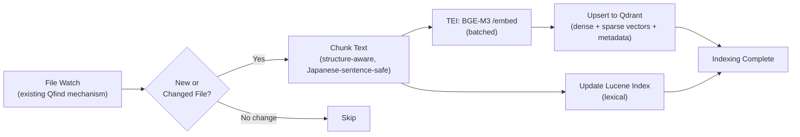

# Qfind Self-Hosted AI Infrastructure — Technical Design Document

**Status:** Implementation-ready draft
**Scope:** Migrate Qfind's AI document-chat features (embeddings + chat completion) from third-party cloud APIs (Jina Embeddings, Groq) to a fully self-hosted stack running on a company-owned Linux server with an NVIDIA RTX 5090 (32GB).
**Primary constraint:** Single GPU, ~20–30 concurrent users, internal + external (internet-facing) access, no user-supplied API keys.

---

## 1. Executive Summary

Qfind's current AI features depend on two external SaaS providers — Jina for embeddings and Groq for chat completion — with end users supplying their own API keys. This creates three unacceptable production risks: the company has no control over cost, availability, or data residency, and every user must manage credentials for services that have nothing to do with Qfind's core file-search product.

The recommended replacement is a single-GPU, fully self-hosted inference stack built from four proven open-source components, each chosen because it is the production-grade, actively-maintained option in its category as of mid-2026:

- **vLLM** for chat LLM serving (PagedAttention, continuous batching, native RTX 5090/Blackwell support since v0.17.0).
- **Hugging Face Text Embeddings Inference (TEI)** for embeddings and reranking (purpose-built, GPU-efficient, dynamic batching, exposes both an embeddings API and a `/rerank` endpoint).
- **LiteLLM Proxy** as the single OpenAI-compatible API gateway in front of both engines, providing per-user virtual API keys, budgets, rate limits, routing, and usage logging — replacing the company's need to hand out raw provider keys.
- **Caddy** as the public-facing reverse proxy, terminating TLS automatically via Let's Encrypt with effectively zero manual certificate management.

This stack runs comfortably on one RTX 5090 because the recommended chat model (Qwen2.5-14B in INT4/AWQ quantization) has a modest 8–10GB weight footprint, leaving ample room for KV cache and concurrent sessions, and the embedding/reranking models (BGE-M3 + BGE-reranker-v2-m3) are compact (2–4GB combined) and can easily coexist with the LLM on the same GPU with predictable VRAM management.

**AnythingLLM is confirmed unsuitable** as the production API layer for Qfind (see Section 4) — its API keys and architecture are designed for its own UI and for power users wiring up personal workspaces, not for issuing scoped, budgeted, rate-limited credentials to an external desktop application's end users at production scale.

**LiteLLM is confirmed as the best gateway choice** among the realistic alternatives (see Section 5) for this specific use case — its virtual-key system, budget/rate-limit enforcement, and OpenAI-compatible surface map almost exactly onto Qfind's requirement ("Qfind talks to one URL with one short-lived key, the company controls everything else").

For 20–30 concurrent users running typical RAG-style document chat (short embedding queries, moderate chat completions), realistic expectations are: time-to-first-token in the 200–600ms range under low-to-moderate concurrency (improved over larger models due to Qwen2.5-14B's lighter prefill cost), sustainable aggregate throughput in the high tens to low hundreds of tokens/second, and embeddings/reranking latency in the tens of milliseconds per request. The model's 10–15GB footprint also leaves predictable headroom for KV cache and concurrent sessions. This is good, but it will not always match Groq's LPU-accelerated speed at very high concurrency — that trade-off is the cost of owning the infrastructure.

The "electricity is the only cost" assumption is **false**. Domain registration, monitoring storage, backup storage, and engineering time for patching/upgrades are recurring real costs, even though they are individually small (see Section 15).

---

## 2. Existing System Overview

| Component | Current Implementation | Issue |
|---|---|---|
| Desktop client | Qfind (Java), local Lucene index over user files | No changes required to search; AI chat path needs rewiring |
| Embeddings | Jina Embeddings API (cloud) | Per-user API key, external dependency, data leaves the network |
| Chat completion | Groq API (cloud) | Per-user API key, external dependency, data leaves the network |
| Vector storage | Implicit / not specified — likely none or ad hoc | Needs an explicit decision (Section 8) |
| Auth | None — user supplies their own raw provider keys | No usage control, no centralized revocation, no audit trail |

The core architectural problem is that **Qfind currently treats AI as "bring your own cloud credential,"** which works for a hobbyist tool but is incompatible with a company offering AI document chat as a supported product feature. The fix is to interpose the company's own infrastructure between Qfind and any model, so Qfind only ever needs one thing: a company-issued API key pointed at a company-controlled OpenAI-compatible endpoint.

---

## 3. Target Architecture

### 3.1 Design Principles

1. **One ingress, one protocol.** Qfind should speak the OpenAI-compatible `/v1/chat/completions`, `/v1/embeddings`, and (optionally) `/v1/audio/*` APIs against a single base URL. This means swapping Jina/Groq for the company endpoint is a configuration change, not a rewrite, since both Jina and Groq already expose OpenAI-style surfaces and most HTTP client code in Qfind likely already assumes this shape.
2. **Separation of concerns.** The gateway (LiteLLM) handles identity, quota, and routing. The inference engines (vLLM, TEI) handle only model execution. The reverse proxy (Caddy) handles only TLS and ingress. Nothing should be doing two jobs at once — this is what makes the system debuggable at 2 AM.
3. **Single GPU, multiple models, explicit budgeting.** With only 32GB VRAM, every model's memory footprint must be deliberately reserved (`--gpu-memory-utilization` in vLLM, `--max-batch-tokens` in TEI) so the chat model and embedding/reranking models can coexist without one starving the other.
4. **No user-managed cloud credentials, anywhere.** Internal users and external users both authenticate to the company's gateway; the gateway holds the only credentials that matter (and there technically are none to "manage" once models are self-hosted, since there is no upstream provider key at all — LiteLLM is fronting locally-hosted models, not re-proxying paid APIs).
5. **Everything that can be a container, is a container.** Reproducibility and disaster recovery depend on the entire stack being declared in Docker Compose (or Kubernetes manifests, if the team later needs multi-node — see Section 13 for why that's not recommended yet).

### 3.2 Component Inventory

| Layer | Component | Why |
|---|---|---|
| Public ingress | Caddy (reverse proxy + automatic TLS) | Zero-touch Let's Encrypt, dead-simple config, good enough performance at this scale |
| DNS | Any registrar + Cloudflare DNS (proxy mode optional) | Hides origin IP, free DDoS mitigation if Cloudflare proxying is enabled |
| API Gateway | LiteLLM Proxy (Postgres-backed) | Virtual keys, budgets, rate limits, usage logs, OpenAI-compatible surface |
| Chat inference | vLLM serving Qwen2.5-14B (INT4/AWQ) | Continuous batching, PagedAttention, native RTX 5090 support; compact 10–15GB footprint |
| Embeddings + reranking | Hugging Face TEI serving BGE-M3 + BGE-reranker-v2-m3 | Purpose-built for embedding/reranking workloads, far lighter than running these through vLLM |
| Vector storage | Qdrant (or pgvector if minimizing moving parts) | Hybrid dense+sparse search support, used alongside Lucene (see Section 8) |
| Secrets | Docker secrets / `.env` files outside version control, optionally HashiCorp Vault later | Master keys (LiteLLM master key, Postgres password) must never live in plaintext repos |
| Containerization | Docker + Docker Compose | Simplicity given a single GPU server; no orchestration overhead needed at this scale |
| GPU runtime | NVIDIA Container Toolkit | Required for any container to see the GPU |
| Monitoring | Prometheus + Grafana + NVIDIA DCGM Exporter + Loki | GPU utilization, request latency, error rates, log aggregation |
| Backups | Restic or simple cron + rsync to off-box storage | Postgres (key/usage data) and Qdrant snapshots |
| Firewall | UFW (host) + cloud/router-level port restrictions | Only 80/443 (and SSH from a restricted source) exposed publicly |

### 3.3 High-Level Data Flow

1. Qfind sends a request (embedding or chat) to `https://api.company-domain.com/v1/...` with a company-issued virtual API key in the `Authorization` header.
2. Caddy terminates TLS and forwards to LiteLLM Proxy over the internal Docker network.
3. LiteLLm validates the key, checks budget/rate limits, and routes the request to the correct backend model alias (e.g., `qfind-chat` → vLLM, `qfind-embed` → TEI).
4. The inference engine processes the request and streams (for chat) or returns (for embeddings) the result back through LiteLLM and Caddy to Qfind.
5. LiteLLM logs the request (tokens, latency, cost-equivalent, user/key) to Postgres for usage tracking and later analysis.

This flow is identical whether the Qfind user is on the company LAN or connecting from the internet — the only difference is which network path Caddy is reachable on, not which logic executes.


---

## 4. Why AnythingLLM Is Not Suitable

The initial assumption that AnythingLLM could serve as UI, model host, embedding host, API gateway, and API key manager simultaneously does not hold up under scrutiny. This section verifies that conclusion with evidence rather than restating the assumption.

### 4.1 What AnythingLLM actually is

AnythingLLM is, by its own documentation and marketing, an **all-in-one desktop and self-hosted application** for document chat, RAG, and AI agents aimed at individuals and teams who want a no-code interface to "chat with their documents." Its GitHub description is explicit about this framing: an app for a "powerful local-first agent experience," not a backend service designed to be embedded inside someone else's production product.

### 4.2 Its API keys are scoped to its own application, not to third-party production traffic

AnythingLLM does expose a developer API, and its documentation states plainly that the API can be used to "manage, update, embed, and even chat with your workspaces." However, the same documentation immediately warns that **anyone holding the key can use the full API** — there is no indication of scoped, per-feature, or per-user key issuance in the way a production gateway requires. The key is closer to a single admin credential for the whole instance than a fine-grained access token system.

This is reinforced by AnythingLLM's own configuration guidance: its documentation explicitly recommends **disabling the Swagger API documentation endpoint in production** to avoid exposing the API structure, and recommends that certain SSO/embed-key features be used only on **internally facing instances not exposed to the public internet**. A system whose own maintainers advise against public internet exposure for some of its authentication conveniences is not a system designed to be the public-facing API gateway for an externally-distributed desktop application serving an unbounded number of end users.

### 4.3 No production-grade multi-tenant key management

Compare what Qfind actually needs — per-user API keys, budgets, rate limits, rotation, revocation, and usage tracking, issued to potentially dozens of external users — against what AnythingLLM provides: workspace-level access control and a single API key per instance (or per admin-created user, in multi-user mode) intended for either the AnythingLLM web UI itself or for "custom development" use cases where a single application embeds AnythingLLM as a sub-service. There is no first-class concept of issuing a scoped key per external consumer with budget and rate-limit enforcement comparable to what LiteLLM provides out of the box (see Section 5). Third-party governance layers like Portkey exist specifically to bolt this missing functionality onto AnythingLLM, which is itself evidence that AnythingLLM does not natively solve the problem.

### 4.4 Architectural mismatch: AnythingLLM is a consumer of model APIs, not a server of them

AnythingLLM's core value proposition is that it is the **client** that talks to 30+ LLM providers (OpenAI, Anthropic, Ollama, vLLM, etc.) and adds a RAG/workspace layer on top. It is not itself a model-serving engine — it does not implement continuous batching, PagedAttention, or any of the GPU-efficient serving techniques that vLLM and TEI provide. If AnythingLLM were placed in front of Qfind, it would still need vLLM or an equivalent engine behind it to actually run the models; AnythingLLM would then be an unnecessary middle layer between LiteLLM/vLLM and Qfind, duplicating chat/embedding functionality that Qfind's own UI already implements, while adding none of LiteLLM's production governance features.

### 4.5 Conclusion

AnythingLLM is an excellent choice for an individual or small team that wants a turnkey, no-code chat-with-your-documents application with a web UI. It is the wrong tool for "issue secure, scoped, production API access to an external desktop application used by dozens of internal and external users," because:

- its API keys are not designed for fine-grained, per-consumer scoping and budget enforcement;
- its own documentation discourages public-internet exposure for some of its convenience features;
- it is architecturally a *client* of inference engines, not an inference engine or a production API gateway itself;
- it would add a redundant UI/workspace layer that duplicates functionality Qfind already has, without adding governance capability LiteLLM doesn't already provide better.

The original instinct to look elsewhere (LiteLLM + vLLM + TEI) was correct.


---

## 5. Why LiteLLM Works as the API Gateway

### 5.1 What the gateway needs to do

Qfind needs a single endpoint that: (a) authenticates a request using a company-issued key, (b) checks that key against a budget and/or rate limit, (c) routes the request to the correct backend model, (d) logs the request for later auditing, and (e) exposes an OpenAI-compatible surface so that Qfind's existing HTTP client code (already written against Jina/Groq's OpenAI-ish APIs) needs minimal changes.

### 5.2 Evaluation against requirements

| Requirement | LiteLLM Proxy | Evidence |
|---|---|---|
| Per-user/team virtual API keys | Yes, native | `/key/generate` endpoint issues scoped `sk-...` keys distinct from the master key; keys can be tied to a `user_id` or `team_id`. |
| Budgets (spend caps) | Yes, native | `max_budget` and `budget_duration` fields on keys and users; requests are rejected with a `budget_exceeded` error once the cap is hit. |
| Rate limits (RPM/TPM) | Yes, native | `rpm_limit`/`tpm_limit` per key, with optional Redis-backed cross-instance enforcement and configurable rate-limit tiers. |
| Model routing / aliasing | Yes, native | `model_list` in `config.yaml` maps a user-facing `model_name` to one or more backend deployments, enabling Qfind to call a stable alias (e.g. `qfind-chat`) regardless of which underlying model or engine serves it. |
| Fallbacks | Yes, native | Configurable fallback chains if a model deployment is unavailable or rate-limited. |
| OpenAI compatibility | Yes, native | The proxy is explicitly described as "a self-hosted OpenAI-compatible gateway"; existing OpenAI SDK clients work by changing only the base URL. |
| Usage logging / cost tracking | Yes, native (open source tier) | Tracks spend and tokens per key/team/user; can forward to Langfuse, Helicone, or other observability tools via callbacks. |
| Self-hosted, open-source, no licensing fee | Yes | MIT-licensed; the proxy software itself costs nothing to run; SSO/SAML, advanced audit logs, and guardrails are reserved for the paid enterprise tier but are not required for Qfind's use case. |

### 5.3 What LiteLLM does *not* solve out of the box (and the implication)

LiteLLM's open-source tier requires the operator to bring their own Postgres database (for key/budget/usage state) and, for multi-instance or strict rate-limit correctness, Redis as well. It does **not** ship its own observability stack — Prometheus/Grafana/Loki must be wired up separately (Section 14). It also does not provide uptime SLAs or vendor support; if a bug surfaces in production, the team is dependent on the open-source community and its own ability to read the codebase. None of this is disqualifying for a single-GPU, 20–30-user internal+external deployment, but it does mean the "deployment" work in Section 9 must explicitly include standing up Postgres, Redis, and the monitoring stack alongside LiteLLM itself — LiteLLM is not a zero-dependency binary.

### 5.4 Alternatives considered and rejected

- **Raw Nginx + a custom auth microservice.** Technically simpler to reason about, but every feature LiteLLM provides for free (budgets, rate limits, per-key model restrictions, usage logs) would have to be hand-built and hand-tested. For a small team without dedicated platform engineers, this is strictly more work for a worse result.
- **Kong / Apache APISIX (general-purpose API gateways).** Both are mature, production-grade API gateways, but neither has first-class understanding of LLM-specific concepts (tokens, model aliases, streaming chat completions, per-model budgets). Using them would mean building an LLM-aware plugin layer on top of a generic gateway — essentially reinventing what LiteLLM already does, on a less LLM-native foundation.
- **Hugging Face TGI's own router.** TGI is in maintenance mode as of December 2025; Hugging Face's own guidance now points new deployments toward vLLM or SGLang for the inference layer, and TGI's router was never intended as a multi-tenant API key/billing gateway in the first place.
- **OpenRouter-style hosted gateways.** These are SaaS products and reintroduce exactly the third-party dependency this project exists to eliminate.

### 5.5 Conclusion

LiteLLM is the right choice **for this specific requirement** (a self-hosted, OpenAI-compatible gateway with per-key budgets and rate limits in front of locally-hosted models). It is not a complete production platform by itself — it still needs a database, optionally Redis, and an external observability stack — but assembling those pieces is standard production-deployment work, not a sign that LiteLLM is the wrong tool.


---

## 6. Technology Comparison Tables

### 6.1 Inference Engines (Chat LLM)

| Engine | Continuous batching | RTX 5090 (Blackwell) support | Best fit | Notes |
|---|---|---|---|---|
| **vLLM** | Yes (PagedAttention) | Yes, native since v0.17.0, with a dedicated SM120 FP8 GEMM path | Broadest hardware/model compatibility, largest community, default recommendation | Requires CUDA 12.8-class toolchain for Blackwell; FP8 fully exposed on native Linux (not WSL2) |
| **SGLang** | Yes (RadixAttention) | Supported, competitive | Prefix-heavy, multi-turn, RAG-style workloads — which is *exactly* Qfind's document-chat pattern | Can show meaningfully higher throughput than vLLM specifically when many requests share a prompt prefix (e.g., the same system prompt + retrieved context structure repeated per query); smaller community than vLLM |
| **TensorRT-LLM** | Yes | Supported, but with a heavier compile/setup burden | Squeezing maximum raw throughput once a deployment is stable and unlikely to change models often | 1–2 weeks of setup investment is a poor fit for a team explicitly described as having limited deployment experience |
| **Hugging Face TGI** | Yes (legacy) | Supported but frozen | Not recommended for new deployments | In maintenance mode since December 2025; HF itself recommends vLLM or SGLang going forward |
| **Ollama / llama.cpp** | No real continuous batching | Yes | Single-user local development, not multi-user production serving | Fine for prototyping a model choice on a laptop before deploying it via vLLM; not a production multi-user serving solution |

**Recommendation: vLLM**, with **SGLang noted as a strong follow-up evaluation** once the system is live and stable with Qwen2.5-14B, specifically because Qfind's RAG pattern (same system prompt + different retrieved chunks per query) is the workload type where SGLang's prefix caching tends to show the largest measured gains. For the initial deployment with Qwen2.5-14B's lighter footprint, vLLM's continuous batching and proven Qwen support are the most reliable choice. Re-benchmark both on the actual Qfind traffic pattern if throughput becomes a measured constraint; this is explicitly the kind of decision that should be validated against real production data rather than fixed permanently from a vendor-neutral report.

### 6.2 Embedding / Reranking Servers

| Server | Purpose-built for embeddings | Reranker support | Notes |
|---|---|---|---|
| **Hugging Face TEI** | Yes | Yes (`/rerank` endpoint) | Flash Attention 2, dynamic batching, gRPC/HTTP; the standard self-hosted choice for this exact workload |
| **vLLM (embedding mode)** | Partial | No native reranker endpoint | vLLM can serve some embedding models, but TEI remains lighter-weight and purpose-optimized for the embed/rerank task specifically |
| **Custom FastAPI + sentence-transformers** | N/A | N/A | Avoid — reinvents batching, queuing, and GPU memory management that TEI already solves |

**Recommendation: TEI**, running two model instances (or one instance per model if VRAM allows) — one for BGE-M3 embeddings, one for BGE-reranker-v2-m3 reranking.

### 6.3 API Gateways

| Gateway | LLM-native | Self-hosted | Per-key budgets/rate limits | OpenAI-compatible |
|---|---|---|---|---|
| **LiteLLM Proxy** | Yes | Yes | Yes, native | Yes |
| Kong / APISIX | No (generic) | Yes | Generic rate limiting only, no token/budget awareness | Requires custom plugins |
| OpenRouter (SaaS) | Yes | No | Yes | Yes | Reintroduces a third-party dependency — disqualified by project goals |
| AnythingLLM | No (consumer of APIs, not a gateway) | Yes | No native per-key budgets | Partial | See Section 4 |

**Recommendation: LiteLLM Proxy.**

### 6.4 Reverse Proxies

| Proxy | Automatic HTTPS | Config complexity | Best fit |
|---|---|---|---|
| **Caddy** | Yes, zero-config Let's Encrypt | Lowest | Small, mostly-static service list (Qfind's case: 1–3 backend services behind one domain) |
| Traefik | Yes, via ACME | Moderate (label-based) | Larger, frequently-changing container fleets — overkill here |
| Nginx (+ Certbot) | Manual cert renewal setup | Highest | Maximum raw performance/control; reasonable if the team already knows Nginx well |

**Recommendation: Caddy**, given the explicit constraint that the report's author has limited production deployment experience — Caddy's near-zero TLS configuration burden directly reduces the riskiest part of a first production deployment (broken or expired certificates).


---

## 7. Recommended Models

### 7.1 Chat LLM

The single RTX 5090 (32GB) is the binding constraint. A dense or MoE model must fit its weights plus KV cache plus activation overhead inside 32GB while leaving headroom for the embedding/reranking models if they share the GPU.

| Model | Params (active) | Quantized VRAM (approx.) | Japanese | English | Notes |
|---|---|---|---|---|---|
| **Qwen2.5-14B** (AWQ or INT4) | 14B dense | ~6–8GB (INT4/AWQ), leaves 24GB for KV cache + embeddings + overhead | Strong — Qwen2.5 demonstrates competitive Japanese language performance on JMMLU and other multilingual benchmarks despite smaller size | Strong | **Primary recommendation.** Fits comfortably on a single RTX 5090 with substantial KV-cache headroom and room for embedding/reranking models; Apache 2.0 licensed; proven in production deployments since late 2024 |
| Qwen3-32B (AWQ or FP8) | 32B dense | ~18–20GB (FP8), less with AWQ | Very strong — superior to Qwen2.5 on Japanese benchmarks, but larger footprint | Very strong | Higher quality alternative if the 10–15GB footprint constraint is relaxed; requires careful VRAM budgeting to leave room for embeddings and KV cache |
| **Qwen2.5-7B** (INT4/AWQ) | 7B dense | ~3–4GB | Good for general multilingual, including Japanese | Good | Ultra-lightweight fallback if Qwen2.5-14B proves VRAM-constrained under peak concurrency; quality/throughput trade-off is noticeable but acceptable for lower-concurrency deployments |
| PLaMo 2 / PLaMo-100B-class Japan-specific models | 8B–100B | Varies | Purpose-built for Japanese, strong on Japanese-specific generation benchmarks (pfgen-bench) | Comparatively weaker than Qwen on English/code | Worth evaluating *only* if Japanese-specific generation quality (not just comprehension) becomes a measured pain point with Qwen2.5 in practice — published comparisons show Qwen2.5-14B actually outperforms similarly-sized PLaMo models on JMMLU, because broad-knowledge tasks are less language-dependent than pure generation fluency |

**Recommendation: Qwen2.5-14B, served via vLLM with INT4 or AWQ quantization.** It is Apache 2.0 licensed (no commercial-use restrictions), has a proven production track record, is explicitly validated by vLLM, delivers strong Japanese-language performance, and leaves a comfortable 24GB of the RTX 5090's VRAM for KV cache, embedding models (BGE-M3), reranking (BGE-reranker-v2-m3), system overhead, and concurrent-user headroom. This allocation provides a realistic safety margin — the primary win of this model choice over larger alternatives is predictable VRAM usage and consistent behavior at 20–30 concurrent users without aggressive memory management.

If the deployed Qwen2.5-14B proves to have insufficient quality on real Japanese-language documents during the pilot phase (Section 9.5, step 10), upgrading to **Qwen3-32B** or a larger model is straightforward — simply re-benchmark on a multi-GPU setup or a more capable server once that constraint is lifted. Do not default to a multi-GPU cluster from day one; start with Qwen2.5-14B's simplicity and upgrade only if quality demands it.

### 7.2 Embedding Models

| Model | Languages | Notes |
|---|---|---|
| **BGE-M3** | 100+, including Japanese | **Primary recommendation.** Single model produces dense, sparse, and multi-vector (ColBERT-style) representations simultaneously, enabling hybrid search (Section 8) without running separate models; 8192-token context; outperforms OpenAI's `text-embedding-3-large` on multilingual benchmarks while remaining competitive on English |
| multilingual-e5-large / e5-large-instruct | 100+ | Strong, slightly behind BGE-M3 on most published multilingual retrieval comparisons; a reasonable fallback if BGE-M3 underperforms on Qfind's actual document corpus during evaluation |
| Jina Embeddings v3 | Multilingual | The current provider's own model — could theoretically be self-hosted instead of replaced, but BGE-M3's hybrid dense+sparse+ColBERT output gives more retrieval flexibility for the RAG pipeline redesign in Section 8 |

**Recommendation: BGE-M3**, served via TEI.

### 7.3 Rerankers

A reranker should be included. The retrieval pipeline (Lucene/vector hybrid search → top-K candidates → reranker → top-N to the LLM) measurably improves answer relevance versus embedding-similarity-only retrieval, and the cost is small: rerankers are lightweight cross-encoders that process only the already-narrowed candidate set, not the full corpus.

| Model | Languages | Notes |
|---|---|---|
| **BGE-reranker-v2-m3** | Multilingual incl. Japanese | **Primary recommendation.** Lightweight cross-encoder built on the BGE-M3 base; fast inference, low VRAM footprint, served directly by TEI's `/rerank` endpoint |
| Jina Reranker v2 (multilingual) | Multilingual | Comparable alternative; worth a side-by-side eval against BGE-reranker-v2-m3 on Qfind's actual document types |
| BGE-reranker-v2-gemma | Multilingual | Higher quality, much heavier (2B-parameter LLM backbone) — only worth the VRAM cost if BGE-reranker-v2-m3's quality proves insufficient in practice |

**Recommendation: BGE-reranker-v2-m3**, sharing the TEI deployment with the embedding model (two separate model-serving processes, same container image, different ports).

### 7.4 Future Models — Speech-to-Text and Text-to-Speech

These are explicitly **optional future work**, not part of the initial migration, but the architecture should not preclude adding them later.

| Capability | Recommendation | Notes |
|---|---|---|
| STT | **Faster-Whisper** (CTranslate2 reimplementation of Whisper Large V3) | 4–6x faster than vanilla Whisper with comparable accuracy; genuinely multilingual including Japanese; runs well on GPU and tolerably on CPU with int8 quantization, meaning it does not have to compete with the chat LLM for RTX 5090 VRAM if deployed CPU-side |
| TTS | **Kokoro** (82M params) for low-resource narration-style output, or **Qwen3-TTS** for the better multilingual/Japanese coverage with low latency | Kokoro is extremely cheap to run but has limited language/voice breadth; Qwen3-TTS (Apache 2.0, ~0.6B–1.7B params) explicitly targets broader multilingual streaming with sub-100ms latency and is the better fit if Japanese TTS quality specifically matters |

Both can be exposed through the same LiteLLM gateway pattern (an OpenAI-compatible `/v1/audio/transcriptions` and `/v1/audio/speech` surface — tools such as the open-source "Speaches" project already wrap faster-whisper + Kokoro/Piper behind exactly this API shape, which is a useful reference implementation rather than a hard dependency).


---

## 8. RAG Architecture

### 8.1 Should Lucene remain?

Yes. Lucene already provides fast, accurate **lexical** (keyword/BM25-style) search over local files, which is something dense embeddings alone are not as good at (exact filenames, error codes, identifiers, rare technical terms, and — importantly for a Japanese-language target audience — exact-match retrieval of names and terms that embeddings can blur together). Removing Lucene would be a regression for the "quickly search local files" use case that is Qfind's core product, independent of the AI chat feature.

### 8.2 Is a vector DB needed?

Yes, in addition to Lucene, not instead of it. Lucene is excellent at lexical search but is not designed as a dense-vector nearest-neighbor index at the scale and update-frequency a chat-with-documents feature needs. Two practical options:

- **Qdrant** — purpose-built vector database with native support for hybrid (dense + sparse) search, which pairs naturally with BGE-M3's multi-representation output. Lightweight enough to run alongside the rest of the stack on the same server, with its own Docker image.
- **pgvector** (a Postgres extension) — minimizes the number of distinct services if Postgres is already required for LiteLLM's key/budget storage. Slightly less specialized for hybrid search than Qdrant but a defensible "fewer moving parts" choice for a team with limited ops experience.

**Recommendation: Qdrant**, specifically because BGE-M3's simultaneous dense + sparse + ColBERT output is most fully exploited by a vector store with native hybrid search support, and Qdrant is explicitly designed for this. If operational simplicity outweighs retrieval-quality marginal gains, pgvector is an acceptable fallback — this is a reasonable place to start simpler and upgrade later, since both stores can coexist with Lucene unaffected.

### 8.3 Hybrid search

The retrieval pipeline should combine:

1. **Lucene BM25 lexical search** over the indexed documents (existing capability, unchanged).
2. **Dense vector search** (BGE-M3 embeddings via Qdrant) for semantic similarity.
3. **Score fusion** (e.g., reciprocal rank fusion, or BGE-M3's own dense+sparse hybrid scoring if using Qdrant's native hybrid query support) to merge the two ranked lists into one candidate set.
4. **Reranking** (BGE-reranker-v2-m3 via TEI) on the merged top-K candidates to produce the final top-N passed to the chat LLM.

This four-stage pipeline (lexical → dense → fuse → rerank) is the production-standard pattern for RAG systems that need both exact-term recall and semantic recall, and it directly addresses the Japanese-language requirement: lexical search catches exact technical terms and proper nouns that embeddings sometimes conflate, while dense search catches semantically related passages that don't share exact vocabulary.

### 8.4 Chunking strategy

- Chunk by semantic/structural boundaries where possible (headings, paragraphs) rather than fixed character counts, falling back to fixed-size chunking (e.g., 512–1024 tokens with 10–15% overlap) for unstructured text.
- Store chunk-level metadata (source file path, page/section, last-modified timestamp) alongside each chunk in Qdrant, so retrieved passages can be cited back to their source file in the Qfind UI — this also lets Qfind invalidate/re-embed only the chunks belonging to a changed file rather than re-embedding the entire corpus.
- For Japanese text specifically, ensure the chunking step is sentence- or paragraph-aware in a way that respects Japanese sentence boundaries (which do not use the same whitespace conventions as English) rather than naively splitting on character count, which can sever a sentence mid-character-cluster.

### 8.5 Embedding pipeline

- Triggered on initial folder indexing and on file-change detection (already part of Qfind's Lucene indexing flow — the embedding step should hook into the same file-watch mechanism rather than being a separate scheduled job).
- Batched calls to TEI's `/embed` endpoint (TEI's dynamic batching is specifically designed to make this efficient — sending many chunks per request is significantly more GPU-efficient than one chunk per request).
- Idempotent: re-embedding a file should overwrite, not duplicate, its prior chunks in Qdrant (keyed by a stable chunk ID derived from file path + chunk index).

### 8.6 Context construction and prompt assembly

- After hybrid retrieval and reranking, assemble the prompt with the reranked passages in descending relevance order, each tagged with its source filename, so the LLM's response can (and should be instructed to) cite which file(s) it drew from.
- Keep a fixed, short system prompt and put all variable content (retrieved passages, user question, conversation history) in the user/context portion — this is also the structure that benefits most from SGLang's prefix caching if that engine is adopted later (Section 6.1).
- Truncate retrieved context to fit comfortably within the model's context window with room left for the response (Qwen2.5-14B supports adequate context length, but very long contexts increase both latency and KV-cache memory pressure on a single GPU — keep practical limits, e.g., a few thousand tokens of retrieved context per query, rather than maximizing context usage by default).

### 8.7 Streaming

Chat responses must stream token-by-token back to Qfind (Server-Sent Events, which vLLM and LiteLLM both support natively) so the desktop UI can render incrementally rather than waiting for a full response — this is the single biggest perceived-latency lever available, since users notice time-to-first-token far more than total completion time.

### 8.8 Caching

- **Embedding cache:** never re-embed unchanged file content (covered by the idempotent pipeline in 8.5).
- **Prompt-prefix caching:** vLLM and SGLang both support automatic prefix caching, which helps when many queries share the same system prompt structure even if the retrieved context differs — enable `--enable-prefix-caching` in vLLM.
- **Reranker result caching:** generally not worth it, since reranking inputs (query + retrieved passages) are rarely identical across requests; skip this unless profiling shows reranking is a measured bottleneck.


---

## 9. Deployment Architecture

This section is written for an audience with limited production deployment experience, so it explains each piece from first principles before showing the assembled stack.

### 9.1 First principles

- **Docker** packages an application and everything it needs to run (libraries, runtime, configuration) into a single unit called a container, so "it works on my machine" becomes "it works in this container, anywhere." Every component in this architecture runs as a container.
- **Docker Compose** is a way to describe a set of containers (and how they connect to each other) in a single YAML file, so the entire stack can be started, stopped, and updated with one command rather than manually running each container by hand.
- **Kubernetes**, by contrast, is an orchestration system designed for managing many containers across many machines, with automatic scheduling, scaling, and self-healing. **It is not needed here.** With a single GPU server and a fixed, small set of services, Kubernetes adds a meaningful operational learning curve and overhead (a control plane, networking layer, persistent volume management) without solving a problem this deployment actually has. Docker Compose on one server is the correct level of complexity for 20–30 users on one GPU.
- **NVIDIA Container Toolkit** is the piece of software that lets a Docker container access the host's GPU. Without it, a container has no way to see or use the RTX 5090 at all — this must be installed on the host before any GPU-using container (vLLM, TEI) will start successfully.
- **A reverse proxy** sits in front of the actual application containers and is the only thing exposed to the internet. It is responsible for TLS termination (turning HTTPS traffic into plain HTTP that gets forwarded internally) and for routing requests to the right backend container based on the hostname or path requested.
- **DNS** is what translates a human-readable domain name (e.g., `api.company-domain.com`) into the server's actual IP address, so the company needs to own a domain and point a DNS record at the server's public IP before HTTPS can work (Let's Encrypt needs to be able to verify domain ownership, which requires DNS to already resolve correctly).
- **A firewall** restricts which network ports are reachable from outside the server. Only the ports the reverse proxy needs (80 for HTTP-to-HTTPS redirect, 443 for HTTPS) should be open to the public internet; everything else (the GPU inference engines, the database, SSH) should either be unreachable from outside or restricted to specific trusted source IPs.

### 9.2 Recommended deployment stack (simplest production-ready path)

```
Host OS: Ubuntu 22.04 or 24.04 LTS
├── NVIDIA driver (matching CUDA 12.8+ for Blackwell/RTX 5090 support)
├── NVIDIA Container Toolkit
├── Docker + Docker Compose
└── docker-compose.yml defining:
    ├── caddy           (reverse proxy, ports 80/443 only public-facing service)
    ├── litellm         (API gateway, internal network only)
    ├── litellm-db      (Postgres, internal network only)
    ├── litellm-redis   (Redis, internal network only — optional but recommended for rate-limit correctness)
    ├── vllm-chat       (GPU container, internal network only)
    ├── tei-embed       (GPU container, internal network only)
    ├── tei-rerank      (GPU container, internal network only)
    ├── qdrant          (vector DB, internal network only)
    ├── prometheus      (metrics, internal network only — or exposed behind auth for the team)
    ├── grafana         (dashboards, internal network only or behind Caddy with auth)
    ├── dcgm-exporter   (GPU metrics, internal network only)
    └── loki + promtail (log aggregation, internal network only)
```

All containers except Caddy communicate over an internal Docker network and are never directly reachable from the public internet — Caddy is the single front door.

### 9.3 SSL/HTTPS

Caddy automatically requests and renews Let's Encrypt certificates for any domain configured in its Caddyfile, with no separate Certbot setup, no manual renewal cron job, and no certificate file management. This single feature is the reason Caddy is recommended over Nginx for a team with limited deployment experience — TLS certificate expiry is one of the most common (and most embarrassing) causes of unplanned outages in self-managed infrastructure, and Caddy removes that failure mode almost entirely.

### 9.4 Internal vs. external access

- **Internal users** (on the company LAN) can reach the server directly via its internal IP/hostname, optionally bypassing the public-facing Caddy instance entirely via a separate internal-only listener, or simply using the same public HTTPS endpoint over the LAN (simpler to maintain one path).
- **External users** reach the same public HTTPS endpoint over the internet. Because Qfind never needs SSH or database access — only the LiteLLM-fronted API — there is no meaningful security difference between internal and external traffic from the gateway's perspective; both authenticate with a virtual API key and both are subject to the same rate limits and budgets.
- If the team wants an extra layer of network-level protection for external access without standing up a VPN, **Cloudflare Tunnel** (or **Tailscale Funnel** for a lighter-weight option) can expose the Caddy endpoint without opening any inbound firewall port at all — worth evaluating once the basic stack is live, since it removes "open port 443 to the world" as an attack surface entirely. This is an optional hardening step, not a requirement for the initial deployment.

### 9.5 Recommended deployment sequence (operationally, not just code)

1. Install NVIDIA driver + NVIDIA Container Toolkit on the bare host; verify with `nvidia-smi` both on the host and inside a test container.
2. Install Docker + Docker Compose.
3. Stand up Postgres + Redis for LiteLLM, verify connectivity.
4. Stand up vLLM serving Qwen2.5-14B (INT4 or AWQ quantized); verify with a direct `curl` to its OpenAI-compatible endpoint before involving LiteLLM at all.
5. Stand up TEI serving BGE-M3 and BGE-reranker-v2-m3; verify with direct `curl` calls.
6. Stand up LiteLLM, configure `model_list` to point at the vLLM and TEI endpoints, generate a test virtual key, verify end-to-end through LiteLLM.
7. Point DNS at the server, stand up Caddy, verify HTTPS works end-to-end from outside the network.
8. Stand up Qdrant, wire the embedding pipeline into it.
9. Stand up Prometheus + Grafana + DCGM Exporter + Loki, confirm dashboards populate.
10. Issue a real virtual key, update Qfind's configuration to point at the new endpoint, and run a controlled pilot with a small group of internal users before rolling out broadly.


---

## 10. Authentication & API Key Management

### 10.1 Design

LiteLLM's virtual key system is used directly rather than building a custom auth layer:

- A single **master key** exists only for administrative operations (creating/revoking other keys) and is never distributed to Qfind installations or end users. It should be stored in a secrets manager or, at minimum, an environment file with restrictive filesystem permissions, never committed to version control.
- Each **user or installation of Qfind** receives its own **virtual key** (`sk-...`), generated via LiteLLM's `/key/generate` endpoint, scoped to the specific models it's allowed to call (`qfind-chat`, `qfind-embed`, `qfind-rerank`) and assigned a `max_budget` and `rpm_limit`/`tpm_limit` appropriate to expected usage.
- Keys can be tied to a `user_id`, enabling per-person usage tracking even though the underlying inference is "free" (self-hosted) — usage tracking still matters for capacity planning and abuse detection.

### 10.2 Periodic rotation and revocation

- Keys should have a `budget_duration` (e.g., monthly) so spend/usage windows reset automatically, and rotation can be operationally implemented as: generate a new key for the user, distribute it (e.g., via a re-authentication flow in Qfind), then revoke the old key after a grace period.
- Revocation is immediate via LiteLLM's key management endpoints — a compromised or departing user's key can be disabled without affecting any other user, which is a direct improvement over the current state where users hold raw provider API keys that the company cannot revoke at all.

### 10.3 Rate limiting and abuse prevention

- Per-key RPM/TPM limits prevent both accidental runaway usage (a buggy Qfind build retrying in a loop) and intentional abuse.
- Redis-backed rate-limit state is recommended over in-memory if the LiteLLM proxy ever runs more than one replica, since in-memory rate limiting does not stay consistent across multiple proxy instances.
- Consider an additional layer of protection at the Caddy level (basic connection-rate limiting per source IP) as defense-in-depth against high-volume abuse attempts that arrive before they even reach LiteLLM's application-level checks.

### 10.4 Secure storage

- LiteLLM's `LITELLM_SALT_KEY` (used to encrypt stored provider credentials, though in this self-hosted-only setup there are no third-party provider keys to encrypt) and the master key itself should be generated with a proper secrets tool, not hand-typed passwords.
- Postgres credentials and any TLS private material should live in environment files excluded from version control (`.gitignore`'d `.env` files) at minimum, with HashiCorp Vault or a cloud KMS-equivalent as a future upgrade if the team's compliance requirements grow.

### 10.5 What this replaces

Today, "authentication" in Qfind means the end user has a Jina API key and a Groq API key, both of which the company has zero visibility into or control over. Post-migration, "authentication" means the company issues, tracks, budgets, rate-limits, and can instantly revoke a single company-controlled credential per user — a strict superset of the current capability with none of the third-party dependency.


---

## 11. Scalability Analysis

### 11.1 Target load

20–30 simultaneous users is a modest concurrency target by inference-serving standards, but "simultaneous users" is not the same as "simultaneous requests in flight" — most document-chat usage is bursty (a user reads a response for several seconds before sending the next message), so the realistic *concurrent in-flight request* count at any given instant is typically much lower than the total user count.

### 11.2 How vLLM handles this

vLLM's continuous batching dynamically groups whatever requests are currently in flight into a single batch on every iteration of the generation loop, rather than waiting for a fixed batch to fill or processing requests strictly one at a time. This is what allows a single GPU to serve many concurrent users without linear throughput degradation — published benchmarks consistently show vLLM keeping GPU utilization in the 85–92% range under concurrent load, versus naive single-request serving which leaves the GPU idle between requests. For Qfind's 20–30 user target, this means the GPU should comfortably interleave multiple users' generations without requiring manual queue management at the application level — vLLM's scheduler handles this internally.

### 11.3 Request queuing behavior

If instantaneous demand briefly exceeds what the GPU can batch (e.g., a spike of 15 simultaneous new chat requests), vLLM queues the excess and admits them into the batch as capacity frees up — this is automatic and does not require Qfind or LiteLLM to implement their own queue. The user-visible effect is a brief increase in time-to-first-token during the spike, not a dropped request, as long as `--max-num-seqs` and `--gpu-memory-utilization` are configured with reasonable headroom rather than tuned to the theoretical maximum.

### 11.4 GPU utilization budget across the three workloads

Because the chat LLM, embedding model, and reranker all need to share one RTX 5090:

- **Chat (Qwen2.5-14B, INT4/AWQ):** a lighter consumer than larger models — budget roughly 8–10GB for weights, leaving 22GB+ for KV cache headroom and concurrent sessions.
- **Embeddings (BGE-M3) + Reranker (BGE-reranker-v2-m3) via TEI:** small models with combined VRAM footprint in the 2–4GB range.
- **System overhead, CUDA drivers, and headroom:** 2–3GB reserved.
- In practice, this allocation (**8–10GB chat + 2–4GB embed/rerank + 2–3GB overhead + 12–18GB KV cache headroom**) means **co-locating all three on one GPU is comfortably realistic** for this load level, with explicit per-process VRAM caps (`--gpu-memory-utilization 0.75` for vLLM, equivalent batch-token limits for TEI) ensuring one workload cannot starve another. Monitor actual VRAM headroom (Section 14) during the pilot phase and adjust caps based on observed behavior.

### 11.5 Expected throughput (qualitative, not a guarantee)

Exact tokens/second figures depend heavily on quantization choice, context length, and concurrency level, and **should be benchmarked on the actual hardware with the actual model** before being treated as a capacity-planning input — vendor and community benchmarks vary by GPU, driver version, and vLLM version, and Blackwell-specific FP8 performance in particular is still an active area of vLLM development as of mid-2026. As a directional estimate: a single RTX 5090 running a 30B-class model in FP8/AWQ with continuous batching has been demonstrated in independent testing to deliver latency and throughput "comparable to leading cloud services" at light-to-moderate concurrency, which is reassuring for a 20–30 user target but should be validated, not assumed, before go-live.

### 11.6 When this stack would stop being sufficient

If usage grows substantially beyond 20–30 concurrent users, or if the team wants to run a larger chat model than fits on one GPU, the next steps (in order of operational complexity) are: (1) add a second GPU and use vLLM's tensor parallelism to split the model across both cards, (2) add a second physical server and use LiteLLM's routing/load-balancing across two independent vLLM deployments, (3) only then consider Kubernetes, once there are enough moving parts that manual Docker Compose management across multiple machines becomes the bottleneck rather than the GPU itself.


---

## 12. Performance Expectations (Latency)

### 12.1 Honest framing

Groq's chat completion and Jina's embedding API are both purpose-built, heavily-optimized cloud services running on hardware and software stacks specifically engineered for low-latency inference at massive scale (Groq's LPU architecture in particular is not comparable to GPU-based serving for raw token-generation speed). **It would be unrealistic to claim a single RTX 5090 will match Groq's latency at high concurrency.** This report will not make that claim.

### 12.2 What is realistically achievable

- **Time-to-first-token (chat):** in the low hundreds of milliseconds under light-to-moderate concurrency (a handful of simultaneous requests), assuming prefix caching is enabled and prompts are reasonably sized. Qwen2.5-14B's smaller size means prefill is proportionally faster than a 32B model would be. This will still increase as concurrency rises toward the 20–30 user ceiling, since more requests compete for the same GPU's prefill capacity.
- **Token generation rate (chat):** expect 40–60+ tokens/second per individual stream under concurrent load on a 14B-class model in INT4/AWQ — actually faster per-token than larger models due to reduced memory bandwidth requirements. Fast enough to feel highly responsive for a reading user.
- **Embedding latency:** typically tens of milliseconds per request for short-to-moderate text chunks on TEI with GPU acceleration — embeddings are a much lighter workload than chat generation and should not be a noticeable bottleneck even at the full concurrency target.
- **Reranking latency:** similarly fast for the kind of candidate-set sizes (tens, not thousands, of documents) a RAG pipeline reranks per query.

### 12.3 What will most affect real-world latency

1. **Quantization choice.** FP8 on Blackwell hardware has dedicated tensor-core support and is the recommended starting point; AWQ is a solid alternative if FP8 tooling proves unstable on a particular vLLM version.
2. **Context length.** Longer retrieved-context windows directly increase prefill time and KV-cache memory pressure — keep retrieved context as short as is consistent with answer quality (Section 8.6).
3. **Concurrency at the moment of the request.** A single user querying an idle system will see the best possible latency; the same user querying during a burst of 15 other simultaneous requests will see meaningfully higher time-to-first-token, by design of continuous batching's fairness model.
4. **Network latency for external users.** Unlike Groq/Jina's globally distributed edge infrastructure, this is a single server in one physical location — external users farther from the server's location will experience added network round-trip time that a globally-distributed cloud API would not impose. This is an inherent trade-off of self-hosting on one server and cannot be fully eliminated without a CDN/edge strategy that is out of proportion to this project's scale.

### 12.4 Recommendation

Set expectations with stakeholders **before** launch: self-hosted infrastructure on one RTX 5090 will be noticeably good for the team's needs and dramatically cheaper at scale, but it will not be a silent, invisible swap for Groq's raw speed at every concurrency level. Benchmark actual time-to-first-token and tokens/second on the real hardware with the real model during the pilot phase (Section 9.5, step 10) and use those numbers — not this report's qualitative estimates — as the basis for any SLA-style commitments made internally.


---

## 13. Security Architecture

### 13.1 Network-level security

- **Firewall:** only ports 80 and 443 open to the public internet (handled by Caddy); SSH restricted to a specific trusted IP range or accessible only via VPN/Tailscale; all internal services (LiteLLM, vLLM, TEI, Qdrant, Postgres, Redis, Prometheus, Grafana) bound only to the internal Docker network, never to a public-facing port.
- **Optional zero-open-port posture:** Cloudflare Tunnel or Tailscale Funnel can eliminate the need to open any inbound port at all, at the cost of routing traffic through a third party's edge network — evaluate this trade-off against the company's data-sovereignty goals, since the stated objective of this project is to avoid third-party dependencies for the AI pipeline itself; using a tunnel provider purely for network ingress (not for AI processing) is a smaller and more defensible exception than the AI dependency this project is removing, but it is still worth being deliberate about.

### 13.2 Application-level security

- **Authentication:** every request must carry a valid LiteLLM virtual key; the master key is never distributed.
- **Authorization:** per-key model restrictions ensure a given Qfind installation's key can only call the models it's meant to (chat, embed, rerank), not any administrative LiteLLM endpoint.
- **Rate limiting / abuse prevention:** per-key RPM/TPM limits (Section 10.3) plus, optionally, Caddy-level connection-rate limiting as defense-in-depth.
- **Brute-force protection:** virtual API keys are long random strings, not user-guessable passwords, which inherently resists brute-force guessing; nonetheless, monitor for repeated authentication failures from a single source as a possible signal of key leakage or scanning activity (Section 14).

### 13.3 Data protection

- **Encryption in transit:** HTTPS end-to-end via Caddy's automatic TLS; internal Docker-network traffic between services does not cross the public internet and is lower risk, but can be further hardened with internal TLS or mTLS if compliance requirements demand it later.
- **Encryption at rest:** disk-level encryption (e.g., LUKS) on the server is a reasonable baseline given that this server will hold the company's and users' potentially sensitive document content (embedded chunks, conversation logs) — this is a host-level decision independent of the application stack described here.
- **Secrets management:** covered in Section 10.4 — no plaintext credentials in version control, master key and database passwords stored in environment files with restrictive permissions or a dedicated secrets manager.

### 13.4 Audit logging

LiteLLM's request logging (per-key, per-user usage and spend tracking) doubles as a basic audit trail — who called what model, how often, and roughly what volume — sufficient for detecting anomalous usage patterns (a single key suddenly making far more requests than its historical baseline) even without a dedicated SIEM.

### 13.5 Intrusion protection

For a single-server deployment at this scale, a full IDS/IPS stack (e.g., Suricata, Wazuh) is likely disproportionate operational overhead relative to the risk profile, but basic host-hardening fundamentals should not be skipped: automatic OS security updates, `fail2ban` (or equivalent) on the SSH port, and regular review of Caddy/LiteLLM access logs for unexpected patterns are a reasonable minimum bar.

### 13.6 What this does *not* need to defend against (and why that matters for scoping effort)

Because all AI processing happens on company-owned infrastructure with no third-party API calls in the inference path, this architecture does not need to defend against a third-party provider's outage, a third-party's data-retention policy, or a third-party's pricing change — risks that exist today and are explicitly eliminated by this migration, which is worth stating plainly as a security and business-continuity win, not just a cost or latency trade-off.


---

## 14. Monitoring & Observability

### 14.1 Recommended stack

| Tool | Role |
|---|---|
| **Prometheus** | Time-series metrics collection (scrapes vLLM, TEI, LiteLLM, DCGM Exporter, Postgres exporter) |
| **Grafana** | Dashboards and alerting on top of Prometheus data |
| **NVIDIA DCGM Exporter** | GPU-level metrics (utilization, VRAM usage, temperature, power draw) exposed in Prometheus format; runs as a standalone Docker container on the GPU host — no Kubernetes required, contrary to some documentation that assumes a cluster context |
| **Loki + Promtail** | Centralized log aggregation across all containers, queryable from Grafana alongside metrics |
| **(Optional) OpenTelemetry** | If the team later wants distributed tracing across the gateway→engine request path; not essential at this scale but worth keeping in mind if the architecture grows multi-node |

### 14.2 What to monitor

- **GPU utilization and VRAM usage** (via DCGM Exporter) — the single most important signal for this deployment, since the RTX 5090 is the shared, finite resource all three model-serving workloads compete for. NVIDIA publishes a ready-made Grafana dashboard (ID 12239) that covers the standard panel set (utilization, memory, temperature, power) with no custom dashboard-building required to get started.
- **Request latency** (time-to-first-token and total completion time) from vLLM's own exposed metrics, scraped by Prometheus.
- **Error rates** from LiteLLM (authentication failures, budget-exceeded rejections, rate-limit rejections, upstream engine errors) — a sudden spike in budget-exceeded or rate-limit errors is a useful early signal of either abuse or a misconfigured Qfind client retrying too aggressively.
- **Availability** of each service (Caddy, LiteLLM, vLLM, TEI, Qdrant) via simple uptime checks — Grafana can alert on a service failing its health check.
- **Queue depth / in-flight request count** on vLLM, to catch sustained overload before it manifests as user-visible latency degradation.

### 14.3 Alerting

Configure Grafana alerts (routed to email, Slack, or another channel the team already monitors) for at minimum:

- GPU VRAM usage sustained above ~90% (early warning before an out-of-memory crash).
- vLLM or TEI container down / failing health checks.
- LiteLLM error rate spike (more than a small percentage of requests failing over a rolling window).
- Disk space on the host dropping below a safety threshold (model weights, logs, and Postgres/Qdrant data all consume disk over time).

### 14.4 Honest scope note

LiteLLM's open-source tier does not include a polished observability dashboard out of the box — this entire Prometheus/Grafana/DCGM/Loki stack is something the team must assemble and maintain itself (estimated setup time: a few focused days for a team unfamiliar with this stack, following the deployment sequence in Section 9.5). This is standard, well-documented, low-risk work — none of these tools are exotic — but it is real work that should be budgeted into the project timeline rather than assumed to come bundled with LiteLLM or vLLM.


---

## 15. Cost Analysis

### 15.1 Verifying the "only cost is electricity" assumption

This assumption is **false**, though it is directionally correct that the *largest single category* of cost (the GPU server itself) is already a sunk capital cost, and electricity is indeed the largest *recurring* cost tied directly to running the GPU at load. The error is in assuming nothing else recurs. Below is every realistic recurring cost category.

### 15.2 Mandatory recurring costs

| Item | Why it's mandatory | Rough order of magnitude |
|---|---|---|
| **Electricity** | The RTX 5090 alone can draw up to ~575W under sustained load; add the rest of the server (CPU, storage, cooling) and a always-on inference server is a meaningful continuous power draw | Varies by local electricity rates and actual utilization duty cycle — estimate based on the server's measured wattage at idle vs. under load, multiplied by local $/kWh |
| **Domain name registration** | Needed for DNS + Let's Encrypt HTTPS to work at all for external access | Roughly $10–20/year for a standard domain |
| **Engineering/maintenance time** | OS security patches, Docker image updates, model upgrades, monitoring review, occasional incident response — this is real, recurring labor cost even if no external invoice is generated | Not a line-item bill, but a real opportunity cost that should be acknowledged in any "total cost" conversation with stakeholders |

### 15.3 Optional but strongly recommended recurring costs

| Item | Why it matters | Rough order of magnitude |
|---|---|---|
| **Off-site backup storage** | Postgres (key/usage data) and Qdrant (vector index) snapshots should not live only on the same physical machine they protect against failure of | Cheap object storage (e.g., a low-cost S3-compatible provider) — typically a few dollars per month for the data volumes this project would generate |
| **Cloudflare (or equivalent) for DNS/CDN/DDoS protection** | Free tier covers DNS and basic DDoS mitigation for a deployment at this scale | $0 on the free tier; paid tiers exist but are not required initially |
| **Monitoring data retention** | Prometheus/Loki data grows over time; if retained indefinitely it consumes disk that must be provisioned | Effectively the cost of additional local disk, not a third-party bill, unless the team chooses a hosted observability backend |

### 15.4 Avoidable costs (explicitly do not pay for these initially)

- **LiteLLM Enterprise tier** (SSO/SAML, advanced audit logs, guardrails) — not needed for a 20–30 user internal+external deployment with no enterprise compliance mandate driving SSO requirements.
- **A second GPU or multi-node cluster** — not needed until concurrency or model-size requirements outgrow the single RTX 5090 (Section 11.6).
- **Managed/hosted Postgres or Redis** — self-hosting these on the same server alongside the rest of the stack is appropriate at this scale; managed database services become worth their premium only at a scale or reliability requirement this project does not yet have.
- **A commercial reverse proxy / API gateway product** — Caddy and LiteLLM's open-source tiers fully cover the requirements here.
- **Per-token charges of any kind** — eliminated entirely by self-hosting, which is the core financial win driving this entire migration.

### 15.5 Honest summary for stakeholders

"Electricity is the only ongoing cost" should be corrected to: **"Electricity is the largest ongoing cost, but a domain name, off-site backup storage, and the team's own maintenance time are real, recurring (if individually small) costs that should be acknowledged rather than assumed away."** None of these change the fundamental economics of self-hosting versus per-token cloud billing — at any meaningful usage volume, this stack will still be dramatically cheaper than continuing to pay Groq/Jina per request — but presenting the cost picture honestly avoids an unpleasant surprise later when a domain renewal or a backup-storage bill arrives and someone asks why "the only cost" wasn't actually the only cost.


---

## 16. Risks and Mitigations

| Risk | Likelihood | Impact | Mitigation |
|---|---|---|---|
| RTX 5090/Blackwell driver or vLLM compatibility issues (this is bleeding-edge hardware for the inference ecosystem) | Medium | High (blocks deployment entirely) | Pin to vLLM v0.17.0+ specifically (the first version with native Blackwell/SM120 FP8 support); test the exact driver + CUDA + vLLM version combination on the actual hardware before committing to a quantization scheme; keep a known-good AWQ fallback configuration in case FP8 proves unstable on a given vLLM release |
| Single point of failure (one GPU, one server) | High (by design, at this scale) | High if it fails during business hours | Accept this trade-off explicitly at this user/budget scale; mitigate with solid backups (Section 15.3) and a documented recovery runbook so a hardware failure means "redeploy the stack on replacement hardware," not "rebuild from scratch" |
| VRAM contention between chat model, embedding model, and reranker causing OOM crashes under peak load | Medium | Medium (service degradation, not data loss) | Explicit per-process VRAM budgets (Section 11.4), Grafana alerting on VRAM usage above ~90% (Section 14.3), load-test before go-live |
| Underestimating engineering time for the "first production deployment" by a team with limited prior experience | High | Medium (schedule slip, not technical failure) | The step-by-step roadmaps (Sections 17–18) are deliberately sequential and incremental specifically to de-risk this; budget more calendar time than feels necessary for the first end-to-end pass, since most of the learning curve is in steps 1–6, not steps 7–10 |
| LiteLLM open-source bugs with no vendor SLA | Low–Medium | Medium | Pin LiteLLM to a specific, tested version rather than always pulling `latest`; monitor the project's GitHub issues for the pinned version before upgrading; keep the architecture simple enough (Section 9) that a bug in LiteLLM can be worked around by temporarily pointing Qfind directly at vLLM/TEI if absolutely necessary, while a fix is sought |
| Japanese-language retrieval/generation quality not meeting expectations in practice with Qwen2.5-14B | Medium | Medium | Treat Qwen2.5-14B as the optimal starting point for the 10–15GB footprint constraint, but plan to run a structured evaluation with real Japanese-language Qfind documents and queries during the pilot phase (Section 9.5, step 10). If quality proves insufficient, upgrade to Qwen3-32B or another larger model (this becomes a hardware/cost trade-off, not an architectural rewrite). Budget evaluation time before declaring the migration complete. |
| External users experiencing materially worse latency than internal users due to network distance | Medium | Low–Medium (UX complaint, not outage) | Set expectations per Section 12.4; consider Cloudflare proxying (Section 9.4) for some edge-level performance benefit on external connections, though this is a partial mitigation, not a full fix, for a single-server architecture |
| Scope creep toward Kubernetes or multi-node complexity before it's needed | Medium | Medium (wasted engineering time, delayed launch) | Explicitly follow Section 11.6's escalation order — do not adopt Kubernetes until Docker Compose on a single machine has demonstrably become the bottleneck, not before |


---

## 17. Step-by-Step Development Roadmap

This roadmap covers the *software/integration* work — building and validating the stack — as distinct from the *deployment/operations* roadmap in Section 18.

1. **Provision and validate the GPU host.** Install Ubuntu 22.04/24.04 LTS, the correct NVIDIA driver for Blackwell support, and confirm `nvidia-smi` reports the RTX 5090 correctly before installing anything else.
2. **Install Docker, Docker Compose, and NVIDIA Container Toolkit.** Validate GPU passthrough into a container with a minimal test (`docker run --gpus all nvidia/cuda:... nvidia-smi`) before attempting to run any real model.
3. **Stand up vLLM with Qwen2.5-14B in isolation.** Get a single-container vLLM deployment serving the chat model directly (no gateway, no proxy yet), with INT4 or AWQ quantization, and validate it with raw `curl` requests against its OpenAI-compatible endpoint, including a streaming request, to confirm both completion and streaming work correctly on this specific hardware/driver/vLLM-version combination.
4. **Stand up TEI with BGE-M3 and BGE-reranker-v2-m3 in isolation.** Validate `/embed` and `/rerank` endpoints directly with `curl`, confirming Japanese-language input produces sensible embeddings/scores (a quick manual sanity check with a few representative Japanese sentences is worthwhile here, before building anything on top).
5. **Build the embedding pipeline.** Wire Qfind's existing file-indexing/file-watch mechanism to also call TEI's `/embed` endpoint and write results (with metadata) into Qdrant, including the idempotent re-embed-on-change logic from Section 8.5.
6. **Build the hybrid retrieval + reranking logic.** Implement the four-stage pipeline from Section 8.3 (Lucene lexical search → Qdrant dense search → fusion → TEI reranking) as a standalone, testable component, independent of the chat UI, so it can be evaluated on retrieval quality alone before being wired into the chat flow.
7. **Stand up LiteLLM with Postgres (and Redis).** Configure `model_list` to alias the vLLM and TEI deployments under stable names (`qfind-chat`, `qfind-embed`, `qfind-rerank`), generate a test virtual key, and validate that the same `curl` requests from steps 3–4 now work correctly when routed through LiteLLM instead of hitting vLLM/TEI directly.
8. **Update Qfind's AI client code.** Point Qfind's existing OpenAI-compatible HTTP client logic at the new LiteLLM base URL with a company-issued virtual key, removing the Jina/Groq-specific key-entry UI entirely. This should be a configuration/endpoint change given that Qfind's client code already speaks an OpenAI-compatible protocol against the prior providers.
9. **End-to-end integration test.** With the full pipeline wired together (retrieval → reranking → prompt assembly → streaming chat response), test the complete document-chat flow from the actual Qfind desktop client against the local development stack, including realistic Japanese-language documents and queries.
10. **Load-test before declaring the integration "done."** Simulate 20–30 concurrent users against the development/staging stack (a simple concurrent-request script against the LiteLLM endpoint is sufficient) to validate that VRAM budgets (Section 11.4) hold under realistic concurrency before moving to production deployment.


---

## 18. Step-by-Step Deployment Roadmap

This roadmap covers taking the validated stack from Section 17 to a live, monitored, secured production environment accessible to both internal and external users.

1. **Register/confirm the company domain and create DNS records** pointing at the GPU server's public IP (an `A` record for the API subdomain, e.g., `api.company-domain.com`).
2. **Configure the host firewall (UFW)** to allow only ports 80, 443, and a restricted-source SSH port; verify no other service ports are reachable from outside before proceeding.
3. **Deploy Caddy** with a Caddyfile pointing the API subdomain at the internal LiteLLM container; verify HTTPS works end-to-end from an external network (not just localhost) and that the Let's Encrypt certificate was issued successfully.
4. **Deploy the full Docker Compose stack** (LiteLLM + Postgres + Redis + vLLM + TEI + Qdrant) on the production host, using the configuration validated in the development roadmap, with production-appropriate resource limits and restart policies (`restart: unless-stopped` at minimum for every service).
5. **Deploy the monitoring stack** (Prometheus, Grafana, DCGM Exporter, Loki/Promtail) and confirm dashboards populate with real data from the running production services, including the NVIDIA-provided DCGM dashboard (ID 12239) as a starting point.
6. **Configure Grafana alerting** for the conditions identified in Section 14.3, routed to a channel the team actually monitors (not just a dashboard nobody looks at).
7. **Set up backups** (Postgres dump + Qdrant snapshot, scheduled via cron or a tool like Restic) to off-site/object storage, and **test a restore** at least once before going live — an untested backup is not a backup.
8. **Generate production virtual keys** for an initial small pilot group of internal users via LiteLLM, with conservative budget/rate-limit settings, and distribute them through whatever secure channel the team already uses for credential distribution.
9. **Run a controlled internal pilot** (a handful of real users, real usage, for at least several days) while watching the monitoring dashboards closely, before expanding to the full internal user base.
10. **Expand to external user access**, re-confirming the firewall/Cloudflare/Tailscale posture from Section 13.1 is correctly applied before external traffic is permitted, and continue close monitoring during the initial rollout window.
11. **Document the runbook**: how to restart a failed service, how to roll back a model upgrade, how to rotate the LiteLLM master key, how to restore from backup — written down *before* an incident happens, not improvised during one.
12. **Establish a routine maintenance cadence**: OS security patches, Docker image updates (pin versions and test upgrades in a non-production path first), and periodic review of usage patterns and Grafana dashboards for early signs of capacity pressure.


---

## 19. Final Recommended Production Stack

| Layer | Choice |
|---|---|
| Chat LLM | **Qwen2.5-14B (INT4 or AWQ)**, served by **vLLM** v0.5.0+ |
| Embeddings | BGE-M3, served by **Hugging Face TEI** |
| Reranker | BGE-reranker-v2-m3, served by **Hugging Face TEI** |
| API Gateway | **LiteLLM Proxy** (Postgres + Redis backed) |
| Reverse Proxy / TLS | **Caddy** |
| Lexical Search | **Lucene** (unchanged, existing) |
| Vector Database | **Qdrant** (hybrid dense+sparse search) |
| Containerization | **Docker + Docker Compose** (single host; no Kubernetes at this scale) |
| GPU Runtime | **NVIDIA Container Toolkit** |
| Monitoring | **Prometheus + Grafana + NVIDIA DCGM Exporter + Loki/Promtail** |
| Backups | **Restic (or cron+rsync) to off-site object storage** |
| Future STT | **Faster-Whisper** (optional, not in initial scope) |
| Future TTS | **Kokoro or Qwen3-TTS** (optional, not in initial scope) |

This is the smallest set of components that satisfies every requirement in the original research brief: no third-party AI API dependency, company-issued API keys replacing user-supplied cloud credentials, production-grade authentication/budgeting/rate-limiting, support for both internal and external users, and realistic operation within a single RTX 5090's VRAM budget for 20–30 concurrent users.

---

## 20. Final Architecture Diagrams

### 20.1 Overall System Architecture



### 20.2 RAG Request Flow (Document Chat)



### 20.3 Embedding / Indexing Pipeline



